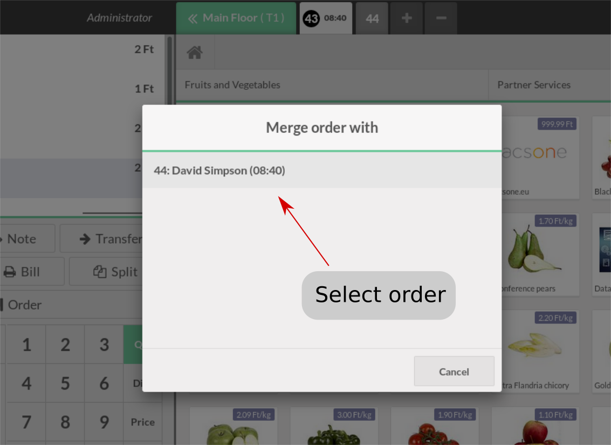

# Merge Point of Sale orders

Has it ever happend, that a customer wanted to pay another person's or perhaps the whole table's orders, but you had to print multiple receipts, since the waiters have recorded them as separate orders? With this module, you'll be able to merge orders and therefore you won't confuse your customers as if you handed out multiple tickets.

## Usage

* Open the order you'd like to merge with another and click the `Merge` action button.

* Select the order, to which you'd like to move the orderlines of the order you opened.

* The orderlines should appear on the order you have selected and the old order will vanish.
